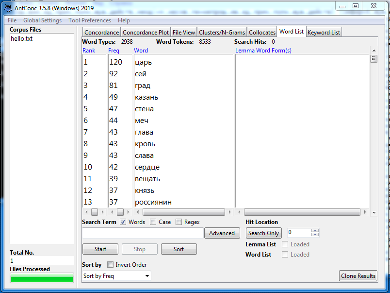

# HW3

**1. AntConc**

частотные слова

коллокативы

частотный список словосочетаний

конкордансы

**2. Google Ngrams и НКРЯ**

1)
*ipm* чернец = 0,75

*ipm* монах = 12,7

Слово "чернец" имело большое распространение в промежуток с 1820-х по 1840-е, позднее слово "монах" вошло в более частое употребление.

2)
*ipm* зрю = 0,47

*ipm* вижу = 119,1

Употребление слова "зрю" приходится на начало XIX века, слово "вижу" активно употребляется с начала XIX века и по сей день.

3)
*ipm* дреколье = 0,05

*ipm* дубина = 1,8

Слово "дреколье" имеет очень низкую частотность, его употребление отмечено лишь пару раз в XX веке. Слово "дубина" вошло в широкое употребление в 1820-х.

**3. Использование инструментов корпусного анализа в профессиональной деятельности.**
Статистический подход к литературе является хорошим подспорьем для её изучения в современном мире. Исследовав корпус, я поняла, насколько доступнее стала возможность структурирования информации в тексте, его визуализации. Литературоведение в совокупности с компьютерными науками (то бишь корпусными исследованиями) могут вывести изучение текстов на новый уровень, а также помочь усовершенствовать область математических методов в науке. Например, с помощью НКРЯ представляется возможным анализ грамматических, лексических, стилистических особенностей писателя. Более того, при помощи вычислительных машин можно соотнести литературный текст с историческими источниками - памятниками литературы, к которым обращался автор произведения.
