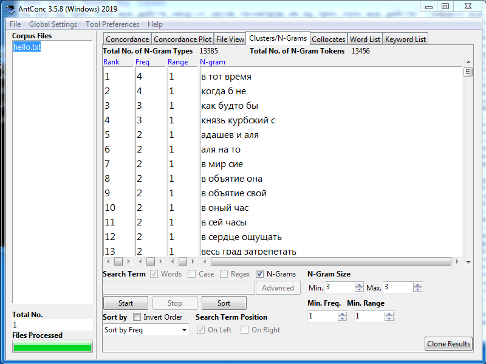

# HW3

**1. AntConc**

частотные слова

коллокативы

частотный список словосочетаний

конкордансы

**2. Google Ngrams и НКРЯ**

1)
*ipm* чернец = 0,75
! 
*ipm* монах = 12,7
! 

2)
*ipm* зрю = 0,47
! 
*ipm* вижу = 119,1
! 

3)
*ipm* дреколье = 0,05
! 
*ipm* дубина = 1,8
! 

**3. Использование инструментов корпусного анализа в профессиональной деятельности.**
Статистический подход к литературе является хорошим подспорьем для её изучения в современном мире. Исследовав корпус, я поняла, насколько доступнее стала возможность структурирования информации в тексте, его визуализации. Литературоведение в совокупности с компьютерными науками (то бишь корпусными исследованиями) могут вывести изучение текстов на новый уровень, а также помочь усовершенствовать область математических методов в науке. Например, с помощью НКРЯ представляется возможным анализ грамматических, лексических, стилистических особенностей писателя. Более того, при помощи вычислительных машин можно соотнести литературный текст с историческими источниками - памятниками литературы, к которым обращался автор произведения.
